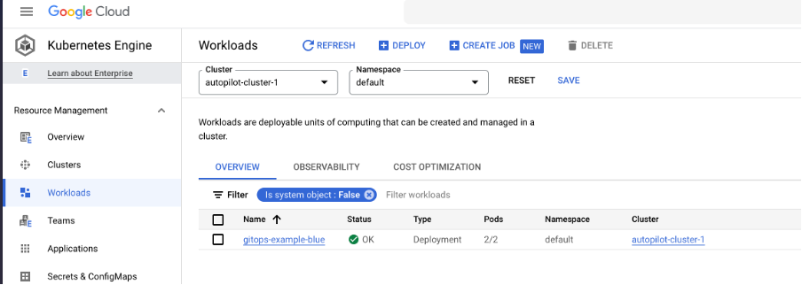
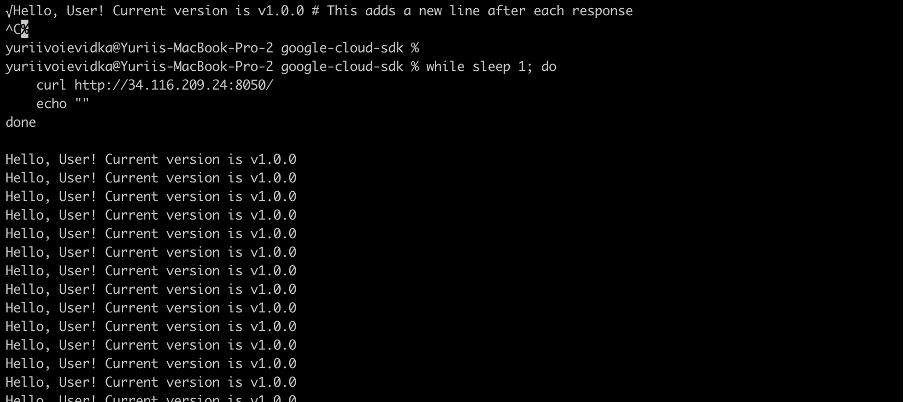
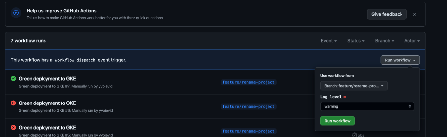
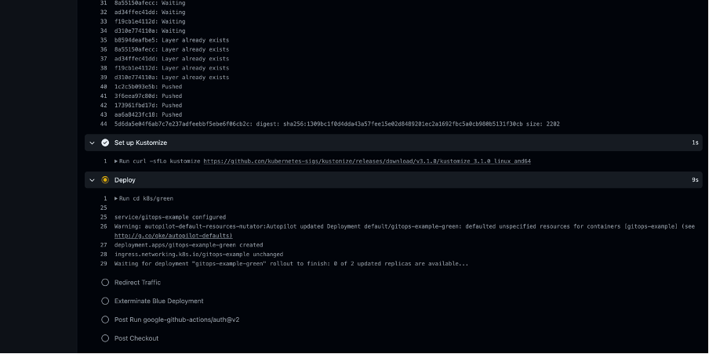
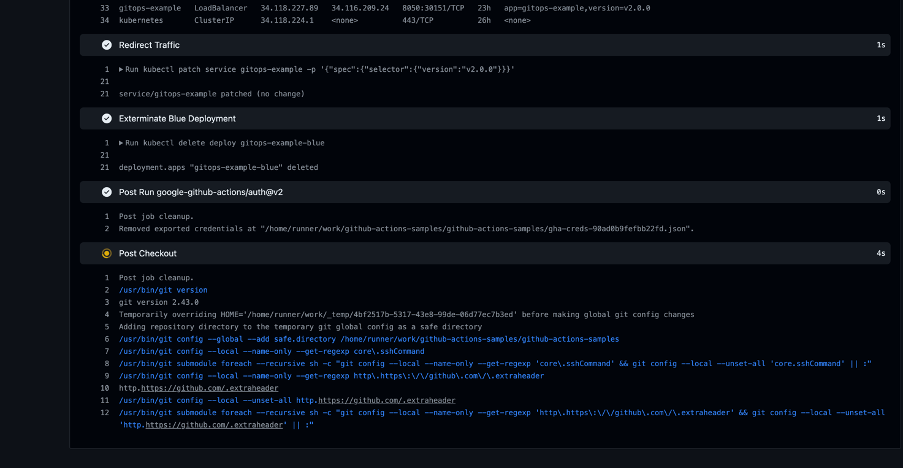
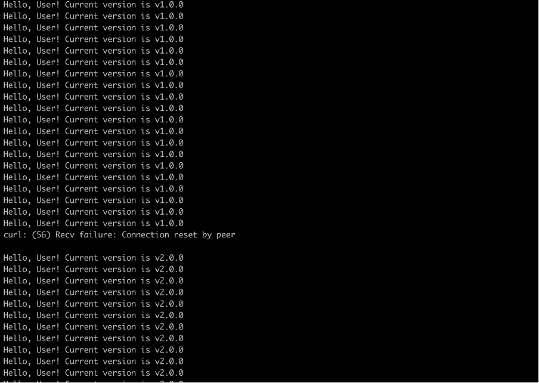

# github-actions-samples | Blue/Green deployment to GKE by Yurii Voievidka

This repo contains Github Actions Workflows that deploy simple Flask App to Google Kubernetes Engine

This repo uses following secrets:
- GKE_PROJECT - id of Google Cloud project
- SA_EMAIL - service account email (yes you should create service account if you don't have one)
- GKE_SA_KEY - encrypted credentials of service account
- GKE_ZONE - region of GKE cluster

## Usage of workflows 

Workflows are triggered MANUALLY! This was done in terms of comfort and cost management.

Suppose you have setuped your empty GKE cluster, and service account.

1. Firstly you need to trigger BLUE workflow, this will lead to build of app image, unit testing and creating the deployment in defined cluster

You should be able to access you app with external link defined in cluster.
In my case it is wowking like that

After looking at this magnificent responce you can start deploying the green version of app, which in our case is v2.0.0

2. Trigger of green deployment workflow is a bit longer. It will create the version 2 of app that defined in k8s/green and after successfull deployment, redirect the traffic to new pod and delete the old blue deployemnt
   

This will lead to consuption of traffic almoust without latency

